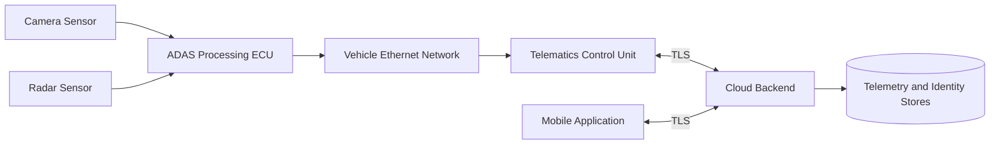

# System Architecture

## Purpose

This document defines the simulated connected vehicle / ADAS architecture used for threat modeling. The goal is to represent a credible end-to-end system with enough detail to support STRIDE analysis without introducing unnecessary implementation noise.

## Architectural Assumptions

- The vehicle contains multiple perception sensors used by an ADAS function.
- A central ADAS ECU fuses sensor inputs and makes driving-assistance decisions.
- A telematics control unit is the primary bridge between the vehicle and external networks.
- A cloud backend stores telemetry, device identity, and user-facing application state.
- A mobile application accesses cloud APIs rather than communicating directly with the vehicle over the public internet.
- In-vehicle communications use Ethernet for high-bandwidth internal data paths.
- External communications use TLS-protected channels.

## Components

### 1. Camera Sensor

The camera provides high-bandwidth visual input used for lane detection, object classification, and scene understanding. It is a safety-relevant data producer and a potential source of false input if spoofed or tampered with.

### 2. Radar Sensor

The radar provides range and velocity information for object tracking and longitudinal control assistance. It complements camera input and is also a high-value integrity target because manipulated radar data can affect downstream ADAS decisions.

### 3. ADAS Processing ECU

The ADAS ECU ingests sensor feeds, performs perception fusion, executes decision logic, and generates vehicle-state outputs or recommendations. It is the most security-sensitive in-vehicle process in this model because it connects safety-relevant logic to network-reachable infrastructure through the telematics path.

### 4. Vehicle Ethernet Network

The Ethernet backbone carries sensor data, ECU telemetry, diagnostics, and gateway traffic between in-vehicle domains. It represents an internal transport fabric rather than a trusted zone by default. Compromise of this network can enable spoofing, tampering, replay, and denial-of-service against internal components.

### 5. Telematics Control Unit

The TCU exposes connectivity for telemetry upload, diagnostics, software management triggers, and mobile-enabled remote services. It is the main boundary component between the vehicle and external networks and therefore a primary attack surface.

### 6. Cloud Backend

The cloud backend terminates device sessions, stores telemetry, exposes APIs to the mobile application, and manages identity, command authorization, and audit logging. It is a central trust and aggregation point; failure here can affect fleets rather than a single vehicle.

### 7. Mobile Application

The mobile application provides user access to vehicle status, selected remote services, and account-linked data. It is a user-facing entry point and introduces risks associated with account takeover, API abuse, insecure client storage, and command repudiation.

### 8. Cloud Data Stores

The backend persists telemetry, audit logs, and device/user identity records. These stores are critical for confidentiality, integrity, and forensic traceability.

## Security Boundaries

### Boundary A: Sensor Boundary

Sensor inputs enter the ADAS processing chain from devices that may be physically exposed or electrically accessible. Integrity is more critical than confidentiality at this boundary.

### Boundary B: In-Vehicle Network Boundary

Traffic moving across the Ethernet backbone must not be assumed trustworthy simply because it is internal. A compromised ECU, debug interface, or gateway path can inject malicious traffic.

### Boundary C: Vehicle-to-Cloud Boundary

The telematics unit crosses from the vehicle domain to external infrastructure. This is the highest exposure boundary in the architecture and requires strong authentication, encryption, input validation, and network hardening.

### Boundary D: User-to-Cloud Boundary

The mobile application interacts with cloud APIs on behalf of the user. This boundary introduces identity, authorization, and session-management risks.

## Architecture Diagram

The diagram below is stored as Mermaid in [diagrams/architecture.mmd](diagrams/architecture.mmd).

## Architectural Security Priorities

- isolate safety-relevant processing from externally reachable interfaces
- treat the telematics unit as an exposed boundary component
- enforce strong identity for device and user communications
- protect integrity of sensor-to-ECU and ECU-to-network data flows
- ensure backend compromise does not directly create unrestricted vehicle control
- maintain traceability across diagnostic, telemetry, and user-driven actions
