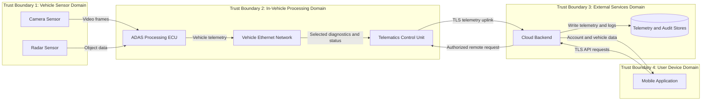

# Data Flow Analysis

## Purpose

This document describes how information moves through the connected vehicle system, where trust boundaries exist, and which attack surfaces are exposed by those flows.

## Primary Data Flows

### 1. Sensor Data Flow

- Camera captures image frames and metadata.
- Radar captures object distance and velocity data.
- Sensor outputs are transmitted to the ADAS ECU.
- The ADAS ECU fuses inputs into perception and control-relevant state.

Security relevance:

- integrity is critical
- latency and availability matter
- spoofed or replayed data can alter decisions

### 2. Vehicle Telemetry Flow

- The ADAS ECU exports status, health, and diagnostic summaries onto the vehicle Ethernet network.
- The telematics control unit receives selected telemetry and packages it for external transmission.
- The TCU sends telemetry to the cloud backend over TLS.

Security relevance:

- confidentiality applies to device state and operational data
- integrity applies to health, diagnostics, and any remotely visible status
- telematics is an external choke point and attack surface

### 3. Remote Access Flow

- The mobile application authenticates to the cloud backend.
- The cloud backend retrieves vehicle state and user-account context from backend stores.
- Authorized user actions may produce cloud-side requests that are relayed toward the vehicle through the telematics control unit.

Security relevance:

- strong authentication and authorization are required
- user actions must be logged and attributable
- cloud-to-vehicle command paths require strict policy enforcement

## Entry Points

- physical access to sensors and maintenance interfaces
- Ethernet-connected internal nodes
- telematics network-facing interfaces
- cloud APIs
- mobile application authentication and session endpoints

## Attack Surface Breakdown

### Sensor Attack Surface

- exposed physical placement
- calibration and maintenance workflows
- firmware update paths
- sensor-to-ECU input channels

### ECU Attack Surface

- sensor parsing logic
- internal service interfaces
- diagnostic and maintenance access
- trust relationships with peer nodes

### In-Vehicle Network Attack Surface

- unauthorized frame injection
- replayed traffic
- unrestricted lateral communication
- bandwidth exhaustion against critical paths

### Telematics Attack Surface

- public or carrier-reachable services
- provisioning and enrollment flows
- update mechanisms
- remote command relay logic

### Cloud Attack Surface

- device-facing APIs
- mobile-facing APIs
- identity and session-management services
- telemetry ingestion endpoints
- storage and admin interfaces

### Mobile Attack Surface

- local token storage
- client-side request manipulation
- session hijacking
- weak device or app integrity assumptions

## Trust Boundaries

### Trust Boundary 1: Sensors to ADAS ECU

Sensors provide externally influenced data into a safety-relevant compute domain. Inputs must be validated and sanity-checked because physical exposure and spoofing are plausible.

### Trust Boundary 2: ADAS ECU to Vehicle Ethernet

Internal network traffic can originate from compromised or unauthorized nodes. The ECU must not trust the network implicitly.

### Trust Boundary 3: Vehicle Domain to External Network

The TCU bridges internal systems to the public network. This is the main boundary where remote attackers can interact with vehicle-adjacent logic.

### Trust Boundary 4: Cloud APIs to Mobile Client

User devices are untrusted execution environments. Access decisions must be made server side, not delegated to the mobile application.

## Data Flow Diagram

The detailed DFD is stored in [diagrams/dataflow.mmd](diagrams/dataflow.mmd).

## Security Analysis Summary

- integrity and authenticity dominate the sensor and ECU path
- segmentation and trust reduction matter inside the vehicle network
- strong device identity and TLS are mandatory at the telematics boundary
- backend authorization decisions are central to preventing abusive remote actions
- audit and telemetry stores require protection because they influence detection, forensics, and user trust
