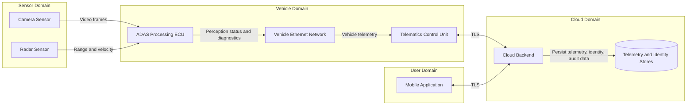
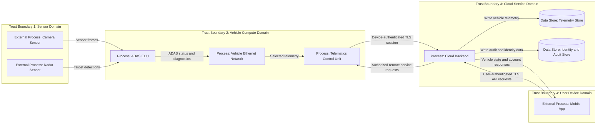
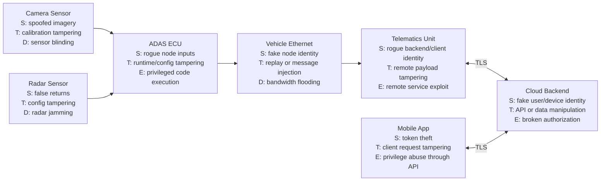

# Diagram Pack

This page embeds all Mermaid diagrams so they render directly on GitHub.

## 1. Architecture Diagram

Source: [diagrams/architecture.mmd](diagrams/architecture.mmd)

## 2. Data Flow Diagram

Source: [diagrams/dataflow.mmd](diagrams/dataflow.mmd)

## 3. Threat Overlay Diagram

Source: [diagrams/threat-overlay.mmd](diagrams/threat-overlay.mmd)

