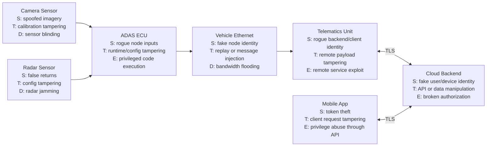

# STRIDE Threat Model

## Purpose

This document applies STRIDE to the modeled connected vehicle system. Threats are grouped by component so the analysis stays tied to the architecture and data flows rather than becoming abstract.

## STRIDE Coverage By Component

## 1. Camera Sensor

- Spoofing: attacker feeds crafted imagery or impersonates a trusted sensor source
- Tampering: image frames, firmware, or calibration data are altered before reaching the ECU
- Repudiation: lack of authenticated event records makes sensor anomalies hard to attribute
- Information Disclosure: diagnostic or calibration interfaces expose proprietary or sensitive configuration data
- Denial of Service: sensor blinding, bandwidth flooding, or fault induction prevents usable camera output
- Elevation of Privilege: compromised maintenance or firmware path enables execution of unauthorized code on the sensor

## 2. Radar Sensor

- Spoofing: attacker injects falsified radar returns or emulates radar-originated data
- Tampering: radar measurements or configuration parameters are modified in transit or at rest
- Repudiation: absent signed logs or traceability obscures whether anomalous outputs came from malfunction or malicious interference
- Information Disclosure: debug interfaces or extracted configuration reveal system capabilities and thresholds
- Denial of Service: radar jamming or resource exhaustion degrades object detection availability
- Elevation of Privilege: malicious firmware update path grants attacker privileged control of radar operation

## 3. ADAS Processing ECU

- Spoofing: ECU accepts unauthenticated data from rogue internal nodes or fake sensors
- Tampering: model inputs, runtime memory, configuration, or output messages are modified
- Repudiation: actions taken by the ECU cannot be reconstructed due to incomplete logging or unverifiable audit trails
- Information Disclosure: memory, debug ports, or diagnostic paths expose algorithms, keys, or sensitive operational state
- Denial of Service: malformed inputs, traffic floods, or compute starvation block timely perception and control logic
- Elevation of Privilege: exploit in services, firmware, or maintenance interface gives attacker privileged code execution

## 4. Vehicle Ethernet Network

- Spoofing: malicious node transmits frames pretending to be a trusted ECU
- Tampering: attacker modifies or replays internal messages affecting telemetry or control-related data
- Repudiation: network events are not attributable to a specific authenticated node
- Information Disclosure: sniffed traffic reveals telemetry, diagnostics, or network topology details
- Denial of Service: flooding or bandwidth starvation disrupts sensor and ECU communication
- Elevation of Privilege: weak network segmentation allows lower-trust nodes to reach higher-trust services

## 5. Telematics Control Unit

- Spoofing: unauthorized backend or client presents fake credentials to the TCU
- Tampering: attacker alters telemetry, software-management triggers, or remote request payloads
- Repudiation: lack of strong request provenance makes remote actions difficult to attribute
- Information Disclosure: exposed interfaces leak credentials, tokens, or sensitive telemetry
- Denial of Service: external connection floods or parser abuse degrade telematics availability
- Elevation of Privilege: exploit in network-facing services or update path yields privileged access to the TCU and possible pivot into the vehicle domain

## 6. Cloud Backend

- Spoofing: attacker impersonates devices, users, or trusted services
- Tampering: API requests, stored telemetry, or command state are modified without authorization
- Repudiation: insufficient audit trails prevent attribution of sensitive account or device actions
- Information Disclosure: API flaws or storage exposure leaks telemetry, PII, device identity data, or secrets
- Denial of Service: API abuse or infrastructure exhaustion blocks fleet connectivity and user services
- Elevation of Privilege: broken access control or service compromise grants cross-tenant, administrative, or command-authoring privileges

## 7. Mobile Application

- Spoofing: attacker uses stolen tokens, session hijacking, or fake UI flows to impersonate a legitimate user
- Tampering: application binaries, requests, or local data are modified on a rooted or instrumented device
- Repudiation: user-initiated actions cannot be reliably tied to an authenticated session with sufficient logging context
- Information Disclosure: insecure storage exposes tokens, cached vehicle data, or account information
- Denial of Service: account lockout abuse or client-side abuse prevents legitimate access to vehicle services
- Elevation of Privilege: mobile app authorization flaws allow normal users to invoke privileged backend actions

## Cross-Cutting Threat Themes

## Threat Overlay Diagram

The threat overlay diagram is stored as Mermaid source in [diagrams/threat-overlay.mmd](diagrams/threat-overlay.mmd) and embedded below so GitHub renders it directly.

### Trust Boundary Abuse

The most important systemic threats occur where trust changes:

- sensor to ECU
- ECU to internal network
- internal network to telematics
- telematics to cloud
- cloud to mobile

### Safety Impact Through Non-Safety Components

Even if the mobile app and cloud backend do not directly control steering or braking, compromise of telematics, backend authorization, or ECU trust can still influence safety-relevant operational state or degrade ADAS availability.

### Data Integrity Over Confidentiality

For ADAS-relevant functions, confidentiality matters, but integrity and authenticity are usually higher-priority because manipulated sensor or decision data can directly affect vehicle behavior.

## Prioritization Guidance

The highest-value threat areas are:

- spoofed or tampered sensor/ECU data
- telematics compromise and pivot into the vehicle domain
- broken cloud authorization enabling unauthorized remote operations
- denial-of-service against critical internal communication paths
- unauthorized privilege gain on safety-relevant compute nodes
